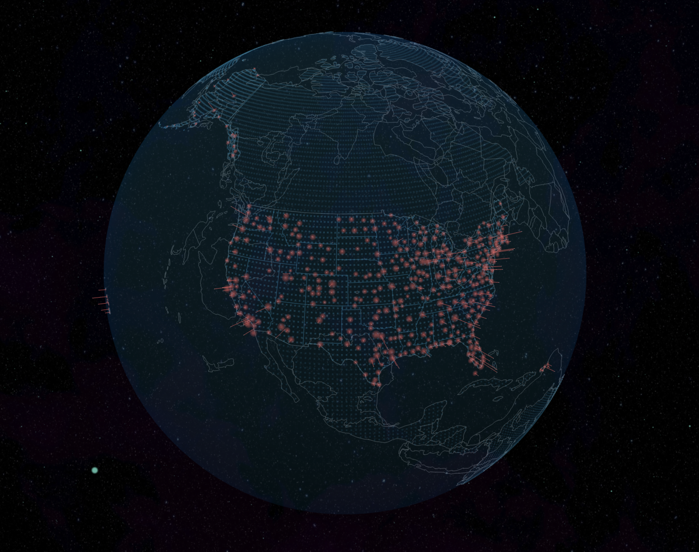

# Earth Visualization with THREE.js



A simple interactive 3D Earth visualization using THREE.js, featuring US airports with address and traffic information. Inspired by [launchit.shanemielke.com](https://launchit.shanemielke.com) (MIT licensed).

[点击这里查看小组会1内容](小组会1.md)

## Features

- 🌍 Interactive 3D Earth model with realistic textures
- ✈️ Markers for major US airports with:
  - Airport names and codes
  - Location addresses
  - Passenger traffic information
- 📱 Mobile-friendly design with touch controls
- 🔍 Zoom functionality to explore locations in detail
- 🌗 Day/night cycle based on real-world time

## Demo

[View Live Demo](https://luxflamy.com)

## Installation & Local Preview

1. **Clone the repo**  

   ```bash
   git clone https://github.com/Luxflamy/earth-usa.git
   cd earth-usa
   ```

2. **Install front-end dependencies**  

   ```bash
   npm install
   ```

3. **Start the model interface**  

   ```bash
   python ./js/utils/example.py
   ```  

   > If you have both Python 2 and Python 3 installed, use `python3` (or add a shebang + `chmod +x`).
4. **Preview in VS Code**  
   1. Open the project folder in VS Code.  
   2. Install/enable the **Live Server** extension (built-in or via the Marketplace).  
   3. In the Explorer, right-click on `index.html` and choose **Open with Live Server**.  
   4. VS Code will launch your default browser at something like `http://127.0.0.1:5500/index.html`.
5. **Alternate fallback** *(if you don't use VS Code Live Server)*  
   open another bash terminal and run

   ```bash
   npx serve .
   ```  

   Then browse to the URL shown in your terminal.

## Usage

- **Desktop**:
  - Left-click and drag to rotate the Earth
  - Right-click and drag to pan
  - Scroll to zoom in/out
  - Click on airport markers for details
- **Mobile**:
  - Touch and drag to rotate
  - Pinch to zoom
  - Tap markers for information

## Technologies Used

- [THREE.js](https://threejs.org/) - 3D JavaScript library
- [WebGL](https://get.webgl.org/) - Rendering context
- [GSAP](https://greensock.com/gsap/) - Animation library (optional)
- [Dat.GUI](https://github.com/dataarts/dat.gui) - Debug UI (optional)

## Data Sources

- Airport data from [OpenFlights](https://openflights.org/data.html)

## Contributing

Contributions are welcome! Please follow these steps:

1. Fork the project
2. Create your feature branch (`git checkout -b feature/AmazingFeature`)
3. Commit your changes (`git commit -m 'Add some AmazingFeature'`)
4. Push to the branch (`git push origin feature/AmazingFeature`)
5. Open a Pull Request

## License

This project is licensed under the MIT License - see the [LICENSE](LICENSE) file for details.

## Acknowledgments

- Inspired by [launchit.shanemielke.com](https://launchit.shanemielke.com) by Shane Mielke
- THREE.js community for amazing examples and support
- NASA for providing beautiful Earth imagery

## Contact

For questions or feedback, please contact:

Xiangyi Li - [xli2579@wisc.edu](xli2579@wisc.edu)
